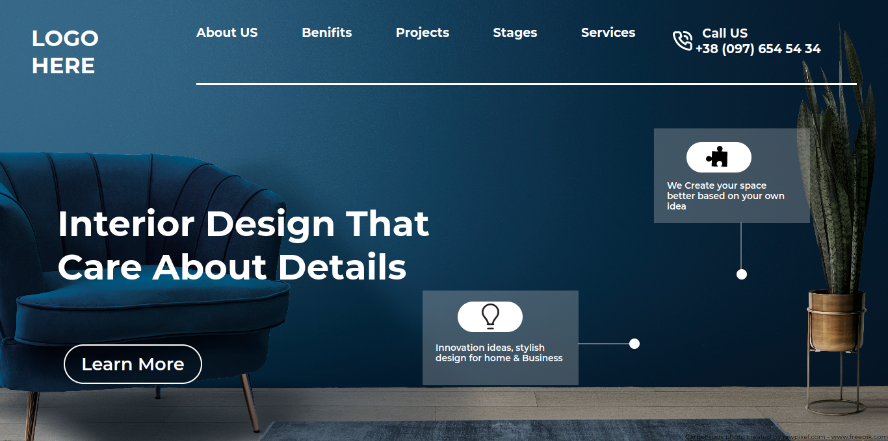

# Assignment 10
## Full Stack Javascript Web Development Course by [iNeuron](https://ineuron.ai/)

This website is created with HTML and CSS only. It is not fully mobile responsive. I will update this project very soon to make it mobile responsive. It took me almost 4 to 5 hours to complete this project. This project helped me to learn drawing line and circular shape and positioning them in proper place using html css. All the images and logos were provided by iNeuron team.

[Click Here](https://fsjs-assignment10.netlify.app/) to view the website.

### Screenshot of the web-page:

## Contact me: [Linkedin](https://www.linkedin.com/in/subham-dutta-8670b8178/) | [Github](https://github.com/Sduttt) | [Twitter](https://twitter.com/Subhamd88404337) | [Facebook](https://www.facebook.com/profile.php?id=100073951804006) | [Instagram](https://www.instagram.com/its_subham_dutta/)

## Find me on [Findcoder.io](https://www.findcoder.io/u/sdutta)